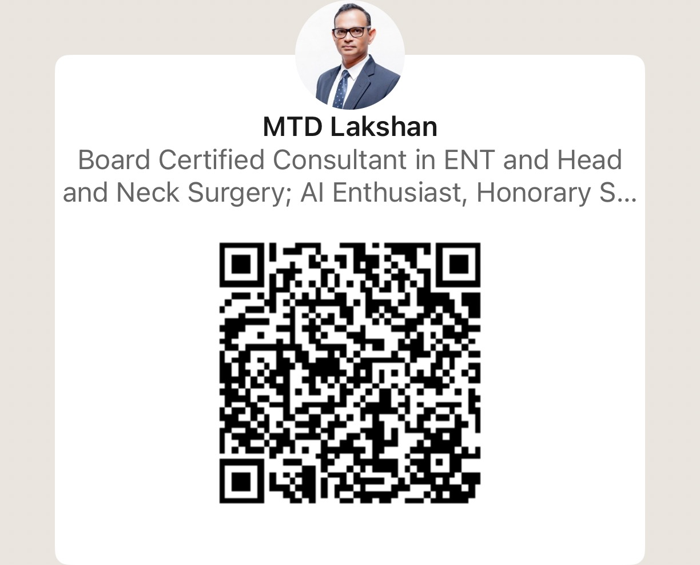

<!--
  Presentation: Becoming an Infinite Learner in the AI Era
  Event: University of Moratuwa
  Date: December 2025
  Presenter: Dr. MTD Lakshan
-->

<!-- _paginate: false -->

# Becoming an Infinite Learner in the AI Era

**University of Moratuwa | December 2025**

Presented by **Dr. MTD Lakshan**

---

<!-- Author slide with credentials -->

## About the Presenter

**Dr. MTD LAKSHAN**
MBBS MS DOHNS FEB ORL HNS FRCS Ed ORL HNS

- Board Certified Consultant in ENT and Head and Neck Surgery
- Senior Lecturer in Medical Education, University of Kelaniya
- Director, Nawaloka Hospitals PLC
- Head, Nawaloka Research and Education Foundation
- Founder, Infinite Learner AI

---

## Agenda

1. What is this talk is NOT about
2. What is it about
3. 3 learning principles
4. 1 example each how AI can help you
5. Summarise
6. Q&A

---

# What this is NOT about

<!-- Your content here -->

- Not an Engineering Lecture on ML/Deep Learning / LLMs etc
- Not about all the tools available and which is the best one to use

> We do not have a problem with AI itself but a problem of INTEGRATION

---

# Whats it About

How to face the Astro Teller Curve

---

# Astro-Teller Curve

---

---
# Principle 1 : Deliberate Practice

---

# Principle 2 : Multimodal Interaction

---
# Principle 3 : Zone of Proximal Development

---

# Conclusion

## Summary

- AI can be used helpfully if properly planned
- Cognitive traps: cognitive debt, cognitive obesity, inappropriate cognitive offloading
- It is imperative we take action today

> "AI can be a FRIEND and a FOE" - MTD Lakshan

---

## Thank You

### Questions & Discussion

**Dr. MTD LAKSHAN**
MBBS MS DOHNS FEB ORL HNS FRCS Ed ORL HNS

**Get in touch:**
- Email: [lakshan@health.lk](mailto:lakshan@health.lk)
- LinkedIn: [mtd-lakshan](https://www.linkedin.com/in/mtd-lakshan-78738213)
- Website: [health.lk](https://www.health.lk)
- Infinite Learner AI: [ilai.academy](https://ilai.academy/)

